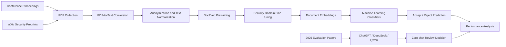

# Unveiling the Sentinels: Assessing AI Performance in Cybersecurity Peer Review

## Introduction

This repository contains the implementation and experimental pipeline for **Unveiling the Sentinels: Assessing AI Performance in Cybersecurity Peer Review**.

The project investigates whether artificial intelligence can predict peer-review outcomes for papers submitted to top-tier cybersecurity conferences. It compares:

- a two-stage **Doc2Vec + machine-learning classification** pipeline;
- ensemble learning methods;
- three representative large language models: **ChatGPT, DeepSeek, and Qwen**.

The study is based on a large corpus containing more than 25,000 computer-science papers. The best Doc2Vec-based model achieves approximately **91% accuracy**, while the evaluated LLMs obtain approximately **60% accuracy** under a basic zero-shot setting.

> **Important:** This project is intended to study and support the peer-review process. It is not designed to replace human reviewers or serve as an independent paper-acceptance system.



---

## Requirements

Recommended environment:

- Python 3.9 or later
- NumPy
- Pandas
- SciPy
- scikit-learn
- Gensim
- NLTK
- PDFMiner
- Requests
- Beautiful Soup
- tqdm
- Joblib
- Matplotlib
- An OpenAI-compatible API client or the corresponding provider SDK for LLM experiments

Clone this repository:

```bash
git clone https://github.com/ethanyuan-research/Assessing-AI-Performance-in-Cybersecurity-Peer-Review.git
cd Assessing-AI-Performance-in-Cybersecurity-Peer-Review
```

Install the main dependencies:

```bash
pip install numpy pandas scipy scikit-learn gensim nltk \
    pdfminer.six requests beautifulsoup4 arxiv tqdm joblib \
    matplotlib openai
```

Download the required NLTK resources:

```bash
python -m nltk.downloader punkt stopwords wordnet omw-1.4
```

> ⚠️ The repository does not currently include a pinned `requirements.txt`. Package versions may need to be adjusted according to the local Python environment.

---

## Dataset

The dataset consists of two main subsets:

| Subset | Label | Source | Number of papers | Main usage |
|---|---:|---|---:|---|
| Proceedings | Accept | Top-tier computer-science conferences | 19,028 | Doc2Vec pretraining and security-paper classification |
| Preprints | Reject proxy | arXiv security preprints | 6,625 | Doc2Vec training and classification |

For the final Big-4 security-conference classification experiments, the study uses:

- **7,229 positive samples:** papers accepted by ACM CCS, IEEE S&P, NDSS, and USENIX Security;
- **6,625 negative samples:** arXiv papers selected through the heuristic rules described in the paper.

The negative samples are constructed using three rules:

1. early arXiv versions of papers that were accepted by a Big-4 venue after substantial revision;
2. security papers published in peer-reviewed venues outside the Big-4;
3. older security preprints that were not found in peer-reviewed publication records.

Raw PDFs and the complete dataset are not included in this repository. Please collect data only from authorized public sources and comply with the terms, licenses, and rate limits of the corresponding websites.

A suggested data organization is:

```text
data/
├── proceedings/
│   ├── security/
│   └── general_cs/
├── preprints/
│   └── arxiv_cs.CR/
├── processed_text/
├── embeddings/
├── models/
└── results/
```

> ⚠️ Update the data, model, database, and output paths in `config.py` according to your local environment.

---

## Repository Structure

```text
.
├── Analyser.py              # Experimental-result analysis and statistics
├── LLM experience.py        # LLM-based peer-review experiments
├── arxiv_fetch.py           # arXiv metadata and paper collection
├── classification.py        # ML classifiers and ensemble experiments
├── config.py                # Paths, parameters, and experiment configuration
├── doc2vec_helper.py        # Doc2Vec training, fine-tuning, and inference helpers
├── experiment_db.py         # Experimental records and database utilities
├── preprocess.py            # PDF and text preprocessing functions
├── preprocess_pipeline.py   # End-to-end preprocessing pipeline
├── utils.py                 # Shared utility functions
└── README.md
```

---

## Data Collection

Use the arXiv collection script to retrieve metadata or papers required by the configured experiment:

```bash
python arxiv_fetch.py
```

The paper additionally uses public proceedings pages and DBLP records to collect accepted papers and verify publication venues.

> ⚠️ Review the paths, year ranges, categories, download intervals, and query settings before running large-scale collection. Respect robots.txt, API limits, and source-site policies.

---

## Preprocessing

The preprocessing pipeline performs the following operations:

1. converts PDF files into plain text;
2. removes author names, affiliations, references, headers, and publication-related information;
3. expands contractions and converts text to lowercase;
4. removes accented characters, stop words, digits, and special characters where configured;
5. applies lemmatization;
6. generates normalized documents for embedding training.

Run the preprocessing pipeline with:

```bash
python preprocess_pipeline.py
```

Individual preprocessing functions are implemented in:

```text
preprocess.py
```

> ⚠️ PDF extraction quality varies across publishers and layouts. Inspect the processed text before training and manually handle malformed or scanned PDFs when necessary.

---

## Doc2Vec Training and Classification

The Doc2Vec-based method follows a two-stage training strategy:

1. **General pretraining:** train Doc2Vec on a large corpus of security and non-security computer-science papers;
2. **Domain fine-tuning:** continue training on security papers to obtain domain-sensitive document representations.

The resulting document embeddings are evaluated with multiple classifiers, including:

- Logistic Regression
- Linear, RBF, and Polynomial SVM
- Gaussian Process
- Decision Tree
- Random Forest
- Boosted Tree
- Multilayer Perceptron
- AdaBoost
- Gaussian Naive Bayes
- K-Nearest Neighbors
- Linear Discriminant Analysis
- Quadratic Discriminant Analysis
- Voting ensemble
- Stacking ensemble

Run the classification experiments with:

```bash
python classification.py
```

Doc2Vec-related helper functions are located in:

```text
doc2vec_helper.py
```

> ⚠️ Confirm that the processed-text paths, saved embedding paths, train/test split, random seed, and model parameters in `config.py` match the intended experiment.

---

## LLM Evaluation

The repository evaluates three representative LLMs:

- GPT-4o mini
- Qwen2.5-72B-Instruct
- DeepSeek-V3

The zero-shot evaluation asks each model to act as an experienced reviewer for top-tier cybersecurity conferences and return an `Accept` or `Reject` decision with a concise explanation.

The evaluation uses both:

- full-paper text;
- abstract-only input.

Run the LLM experiment script with:

```bash
python "LLM experience.py"
```

Before running the script:

1. configure the required API endpoint and credentials;
2. confirm the model names supported by the selected provider;
3. set request intervals, timeout handling, and retry limits;
4. avoid committing API keys to the repository;
5. estimate API cost before processing the full dataset.

---

## Validation

To analyze saved predictions and experimental outputs, run:

```bash
python Analyser.py
```

The main evaluation metrics are:

- Accuracy
- F1 Score
- AUC
- False Positives
- False Negatives
- Training and testing time

The experiment records can be managed through:

```text
experiment_db.py
```

---

## Main Results

### Doc2Vec-based Models

| Method | Accuracy | F1 Score |
|---|---:|---:|
| Random Guess | 0.500 | 0.500 |
| Voting on Abstract | 0.825 | 0.825 |
| Voting Classifier | **0.910** | **0.910** |
| Linear SVM | 0.908 | 0.908 |
| Gaussian Process | 0.908 | 0.907 |
| LDA | 0.909 | 0.909 |
| Average across classifiers | 0.8598 | 0.8553 |

### LLM-based Models

| Model and input | Accuracy |
|---|---:|
| ChatGPT — Abstract | 54.7% |
| ChatGPT — Full text | 54.0% |
| DeepSeek — Abstract | **64.2%** |
| DeepSeek — Full text | 61.5% |
| Qwen — Abstract | 55.8% |
| Qwen — Full text | 61.4% |

The LLM experiments reveal a strong tendency to predict `Accept`, especially when processing full papers. These results should be interpreted as an unoptimized zero-shot baseline rather than the upper bound of LLM-based peer review.

The temporal-distribution-shift experiment also shows that prediction accuracy declines on newer papers, highlighting the need for continuous model updating and human oversight.

---

## Reproducibility Notes

- The `Reject` class is based on heuristic proxy labels rather than confidential conference rejection records.
- Train/test leakage must be carefully controlled when multiple versions of the same paper exist.
- LLM results can change with model updates, API versions, prompt changes, decoding settings, and provider-side system prompts.
- Temporal evaluation should keep newer papers strictly separated from training data.
- AI-generated decisions should not be interpreted as formal reviews or publication recommendations.
- Human experts must remain responsible for assessing novelty, correctness, reproducibility, ethics, and scientific contribution.

---

## Acknowledgements

This project uses or builds upon the following open-source tools and public research resources:

- [Gensim Doc2Vec](https://radimrehurek.com/gensim/)
- [scikit-learn](https://scikit-learn.org/)
- [PDFMiner](https://github.com/pdfminer/pdfminer.six)
- [NLTK](https://www.nltk.org/)
- [arXiv](https://arxiv.org/)
- [DBLP](https://dblp.org/)

The research was supported by the Center for Cyber Security at New York University Abu Dhabi, and the experiments used NYU Abu Dhabi High Performance Computing resources.

---

## Citation

If you find this repository useful, please cite our paper:

```bibtex
% Please update the publication venue and year after formal publication.
@misc{xue2026unveiling,
  title         = {Unveiling the Sentinels: Assessing AI Performance in Cybersecurity Peer Review},
  author        = {Xue, Nian and Niu, Liang and Yuan, Cheng and Zhao, Liyuan and P{\"o}pper, Christina and Li, Zhen},
  year          = {2026},
  eprint        = {2309.05457},
  archivePrefix = {arXiv},
  primaryClass  = {cs.CR}
}
```

---

## Contact

For questions or discussions, please contact:

- **Cheng Yuan:** [23110507069@stumail.sdut.edu.cn](mailto:23110507069@stumail.sdut.edu.cn)
- **Project repository:** [Assessing-AI-Performance-in-Cybersecurity-Peer-Review](https://github.com/ethanyuan-research/Assessing-AI-Performance-in-Cybersecurity-Peer-Review)
