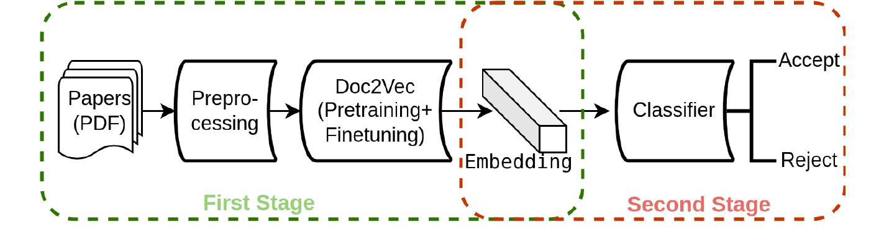

# Unveiling the Sentinels: Assessing AI Performance in Cybersecurity Peer Review

## Introduction

This repository contains the implementation of **Unveiling the Sentinels: Assessing AI Performance in Cybersecurity Peer Review**.

We study whether AI can predict peer-review outcomes for top-tier cybersecurity papers. The proposed method first uses Doc2Vec to generate paper embeddings and then applies machine-learning classifiers to predict `Accept` or `Reject`. We also evaluate ChatGPT, DeepSeek, and Qwen as zero-shot AI reviewers.

<p align="center">
  
</p>

The best Doc2Vec-based model achieves approximately **91% accuracy**, while the evaluated LLMs achieve approximately **60% accuracy** under the zero-shot setting.

---

## Requirements

The dependencies and package versions have not yet been pinned. Please configure the required environment and file paths according to the source code and `config.py`.

---

## Dataset

The dataset contains more than **25,000** computer-science papers, including:

- 19,028 accepted papers from top-tier computer-science conferences;
- 6,625 security-related arXiv preprints used as rejection proxies.

The final classification experiment uses 7,229 accepted Big-4 security papers and 6,625 arXiv preprints.

---

## Preprocessing

Run the preprocessing pipeline:

```bash
python preprocess_pipeline.py
```

The pipeline converts PDFs to text, removes author-related information, and normalizes the paper content.

> ⚠️ Adjust the data paths in `config.py` before running.

---

## Classification

Run the Doc2Vec-based classification experiments:

```bash
python classification.py
```

The repository evaluates multiple machine-learning classifiers, including Voting and Stacking ensembles, on Doc2Vec paper embeddings.

---

## LLM Evaluation

Run the LLM-based experiments:

```bash
python "LLM experience.py"
```

Please configure the corresponding API information before running the script.

---

## Validation

Analyze the experimental results with:

```bash
python Analyser.py
```

The main evaluation metrics include Accuracy, F1 Score, and AUC.

---

## Contact

For questions or discussions, please contact [23110507069@stumail.sdut.edu.cn](mailto:23110507069@stumail.sdut.edu.cn).
